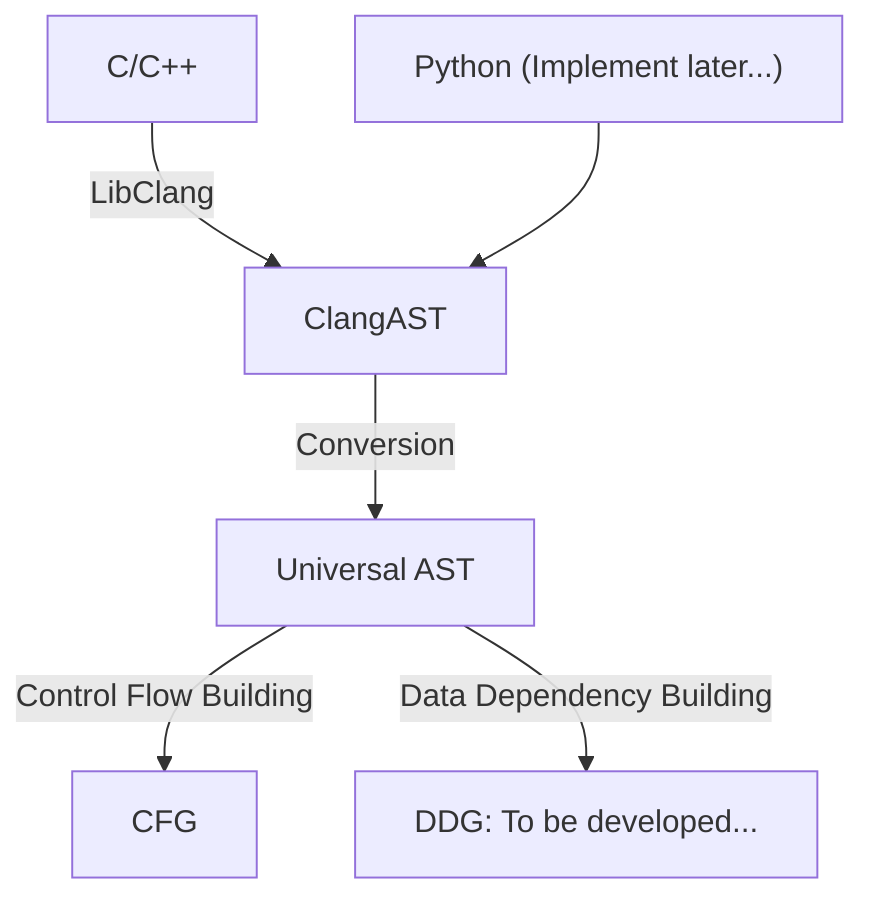

# MetronomeStatic
<svg t="1712932897209" class="icon" viewBox="0 0 1024 1024" version="1.1" xmlns="http://www.w3.org/2000/svg" p-id="4262" width="200" height="200"><path d="M512 74.666667l-146.346667 39.253333-192.426666 719.36c-1.28 6.4-2.56 13.226667-2.56 20.053333 0 47.36 37.973333 85.333333 85.333333 85.333334h512c47.36 0 85.333333-37.973333 85.333333-85.333334 0-6.826667-1.28-13.653333-2.56-20.053333l-58.026666-218.026667L725.333333 682.666667l8.533334 42.666666h-161.706667l121.173333-121.173333-60.16-60.16L451.84 725.333333H290.133333l148.906667-554.666666h145.92l62.293333 231.68 69.546667-69.973334-58.453333-218.453333L512 74.666667M480 213.333333v416l64-64V213.333333h-64m364.373333 119.466667l-120.746666 120.746667-30.293334-30.293334-60.16 60.586667 120.32 120.32 60.586667-60.16-30.293333-30.293333 120.746666-120.746667-60.16-60.16z" p-id="4263" fill="#1296db"></path></svg>
[](https://github.com/hzyrc6011/MetronomeStatic/actions/workflows/pages/pages-build-deployment)

A pure-python (Python>=3.8) static analysis library providing various interfaces.

For detailed informations, please visit this webpage:
[Documentation Website](https://hzyrc6011.github.io/MetronomeStatic/)

## Installation

```bash
pip install MetronomeStatic
```

If you would like to run it in jupyter, please install jupyter by the commands below:

```bash
pip install jupyterlab ipywidgets
```

## Architecture



## Conversions

### AST to UML

There are 2 categories of UML:

- Structural UML:
    1. Class Diagram
    2. Object Diagram
    3. Component Diagram
    4. Deployment Diagram
    5. Package Diagram
    6. Composite Structure Diagram
- Behavioral UML:
    1. Sequence Diagram
    2. Communication Diagram
    3. Timing Diagram
    4. State Machine Diagram
    5. Activity Diagram
    6. Use Case Diagram
    7. Interaction Overview Diagram
    8. State Diagram

## Interfaces

### Clang

Clang interface included some useful functionalities.
