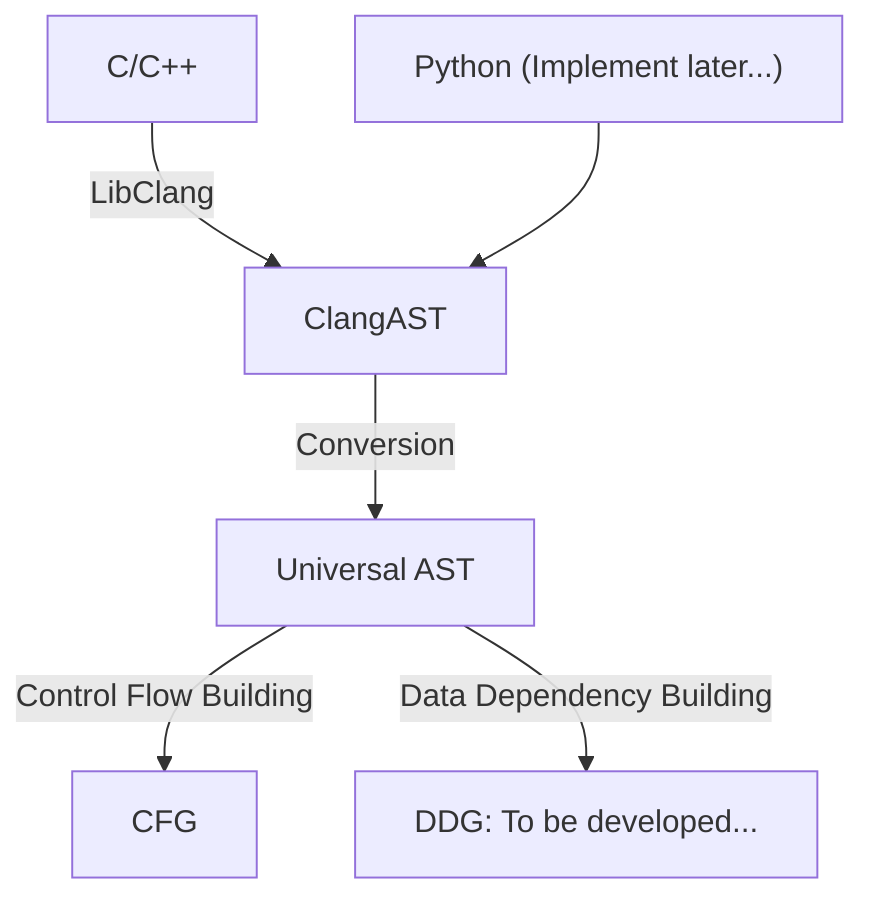

# MetronomeStatic静态分析工具

## 安装

```bash
pip install MetronomeStatic
```

## 架构图



## Interfaces

### Clang

Clang interface included some useful functionalities.

## Plannings

### Supporting DDG

### Supporting other languages such as Python

### Code to UML
