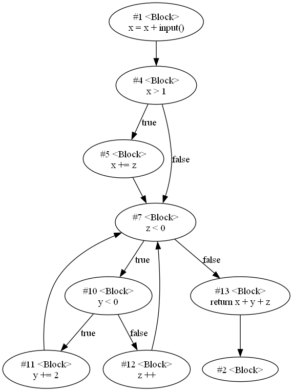
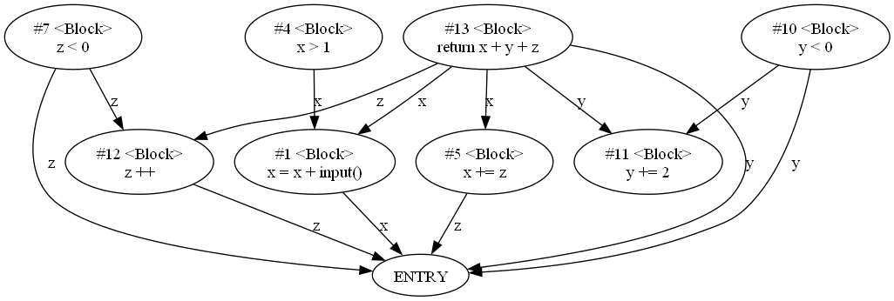

PyBirdViewCode简介
=================

## 简介

PyBirdViewCode是一个用于静态代码分析的Python包，目标是将代码的依赖关系和逻辑关系以图形化、抽象化的形式表示出来，便于程序理解。希望这个包能够帮助大家从更高的角度分析代码，鸟瞰整体，把握全局。

## 安装

```
pip install PyBirdViewCode
```

## 使用

- [项目简介](docs-zh/1.项目简介.md)
- [入门教程](docs-zh/3.入门教程.md)
- [架构设计](docs-zh/2.入门教程.md)
- [算法介绍](docs-zh/5.算法介绍.md)

## 我为什么要开发这个包

软件静态分析的门槛着实不算低。不必说静态分析相关的理论一个比一个难懂，光是寻找和使用相应的工具，也要大费周章。以本人为例，本人熟悉的语言主要是Python，而大部分代码分析工具都是基于C++或者Java语言开发的。因此对我而言，这类工具的入门难度便更高了一层。

除了门槛高之外，每一位像我这样，习惯了Python枝繁叶茂的生态系统的开发者，也时常会想念Python中丰富的标准库和第三方库，但为了实现业务，又不得不用自己不熟悉的语言去造轮子。所以，为了更早下班，我常常思考一件事情：**能不能将Python用在代码分析当中**？

事实上，我也调研到了很多使用Python代码分析包，比如说`LibClang`，是Clang工具的Python绑定；又如`PyC-CFG`包，可以针对C/CPP语言生成控制流图。但是很明显，这些包在功能上比较琐碎，不同包之间的接口也不一样，即使是两个包之间的所谓“胶水”代码，开发量也并不低；此外，这类算法比较难扩展到其他编程语言，若要分析不同的编程语言，还得学习不同的包，解析不同的语法树。

因此，我便更加希望结合我的实际工作经验，开发一个真正适合Python的代码静态分析包，这样，不仅能让熟悉Python的开发者专注于算法和理论本身，还能充分利用丰富的第三方包来支撑我们的分析。

## 为什么要将抽象语法树统一化？

受到Semgrep和Joern这两种代码分析工具的启发，我发现统一抽象语法树（Universal AST）在处理这种问题上拥有着得天独厚的优势。以从代码中提取控制流图（Control FLow Graph, CFG）为例，当不使用UAST时，处理流程是这样的：


可以看出，不使用UAST时，每种语言的抽象语法树转换为控制流图的算法，都要单独地进行开发；而引入UAST的处理流程是这样的：


可以看出，引入了UAST之后，每种语言转换为UAST之后，即可直接复用`UAST-->CFG`的分析流程。

看到这里，你或许会想：直接从AST转换为CFG不好吗？比如第一张图中，三种语言的AST到CFG中间只有3个箭头，而第二张图中，却是有了4个箭头，这不是多了一步吗？**但实际上，AST-->UAST的变换，比AST-->CFG的变换简单的多**。虽然都是遍历抽象语法树，但前者只要递归遍历抽象语法树就好，后者除了遍历语法树，还需要仔细管理控制流图构建状态，两者的开发复杂程度不可同日而语。

更何况，在控制流分析算法之外，还有可达定义分析、活跃变量分析等多种多样的高层次分析。如果UAST支持了这些分析，那么只要将实际的编程语言转换为UAST，那么基本就足以运行这些分析了。

## PyBirdViewCode工作流程图

以下是PyBirdViewCode的功能图，注意，PyBirdViewCode目前仅支持C/C++，后续会支持Python、Golang等其他语言。


## PyBirdViewCode支持的语言

|    |  编程语言   |  UAST支持程度   | 如何使用                                               |
|---:|:--------|:------------|:---------------------------------------------------|
|  0 | C       | 可用          | 自带，基于LibClang                                      |
|  1 | C++     | 测试          | 自带，基于LibClang                                      |
|  2 | Python  | 开发中         | 自带，基于Parso                                         |
|  3 | Golang  | 开发中         | [仓库链接](https://gitee.com/hzy15610046011/asty2uast) |

## 使用教程及文档

- [项目简介](docs-zh/1.项目简介.md)
- [入门教程](docs-zh/3.入门教程.md)
- [架构设计](docs-zh/2.入门教程.md)
- [算法介绍](docs-zh/5.算法介绍.md)

## 支持功能展示

### 抽取代码属性图

#### 控制流图（CFG）



#### 控制依赖图（CFG）


#### 数据依赖图（DDG）



#### 程序依赖图（PDG）


