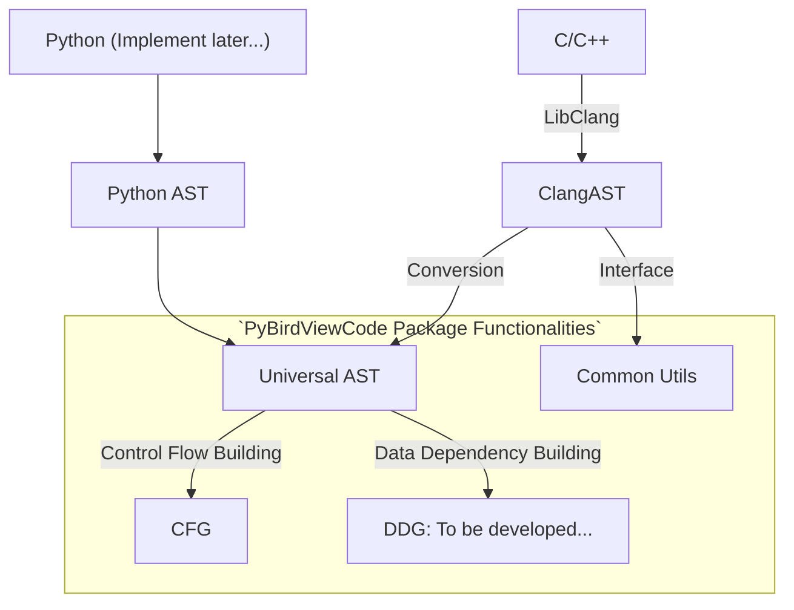

# PyBirdViewCode静态分析工具

## 简介

PyBirdViewCode是一个用于静态代码分析的Python包，目标是将代码的依赖关系和逻辑关系以图形化、抽象化的形式表示出来，便于程序理解。希望这个包能够帮助大家从更高的角度分析代码，鸟瞰整体，把握全局。

以下是PyBirdViewCode的功能图。现在只支持C/C++，基于libclang实现。在未来，计划进一步添加Python的 AST



在上面的图中，AST代表抽象语法树，这是一个树形结构
用某种语言表示程序结构。UAST代表通用AST，一个通用的抽象语法树(AST)跨不同语言的表示

以上图中C/C++节点的路径为例。C/C++通过LibClang转换为Clang抽象语法树(Clang AST)，然后Clang AST可以转换为PyBirdViewCode中定义的UAST。UAST可以用来构建控制流图(CFG)和数据依赖图(DDG)

由于UAST可以表示不同语言的AST，因此可以进行控制流和数据流的分析，构建控制流图、数据依赖图等程序图。由于这一过程依赖的UAST与具体的编程语言无关，因此就可以避免添加新语言时重新写一遍构建程序图的逻辑的繁琐情况。

### 支持的编程语言

- C：目前可以使用
- C++：正在开发
- Python：尚未开始

## 安装

```bash
pip install PyBirdViewCode
```

## 示例

### 获取UAST & UAST 的保存与读取

- UAST的文档见：[UAST Docs](https://hzy15610046011.gitee.io/metronome-static/html/api/universal_ast.html)

- 该示例位于`examples/uast-conversion`下

给定一个待分析的C文件:

MACRO {"kind": "file", "path": "examples/uast-conversion/uast-demo.c", "language": "c", "with_path": true}

可按如下步骤编程以进行分析:

MACRO {"kind": "file", "path": "examples/uast-conversion/demo.py", "language": "python", "with_path": true}

运行输出:

MACRO {"kind": "file", "path": "examples/uast-conversion/expected_out.txt", "language": "plaintext"}

可以看出，直接print输出的结果可读性并不太好，但查看打印出的JSON就轻松多了：

MACRO {"kind": "file", "path": "examples/uast-conversion/dumped-ast.json", "language": "json"}

以上的JSON是一个嵌套结构，每一项的`_cls`属性记录了UAST节点的类名，其余不以下划线开头的属性都是该节点相应对象的属性。

既然UAST可以保存，那么也可这样读取：

MACRO {"kind": "file", "path": "examples/uast-conversion/load_uast.py", "language": "python"}

### 遍历UAST

给定一个C文件：

MACRO {"kind": "file", "path": "examples/uast-traverse/demo.c", "language": "c"}

通过以下方法，可以遍历该C文件的所有FuncCall节点，并打印出其函数名：

MACRO {"kind": "file", "path": "examples/uast-traverse/demo.py", "language": "python"}

输出：

MACRO {"kind": "file", "path": "examples/uast-traverse/out.txt", "language": "plaintext"}

### 获取控制流图CFG

给定一个C文件：

MACRO {"kind": "file", "path": "examples/cfg-extraction/demo.c", "language": "c"}

运行如下Python文件将其转换为控制流图，并且输出Dot文件：

MACRO {"kind": "file", "path": "examples/cfg-extraction/demo.py", "language": "python"}

得到.dot文件之后，可以用`dot -Tpng cfg.dot -o cfg.png`转化cfg.dot为png格式的图片，如下图：


注意，如果提示没有安装dot，可以按照<https://graphviz.org/download/> 这里的方式进行安装

## Interfaces

### Clang

Clang interface included some useful functionalities.

## 未来计划

### Supporting DDG

### Supporting other languages such as Python

### Code to UML
