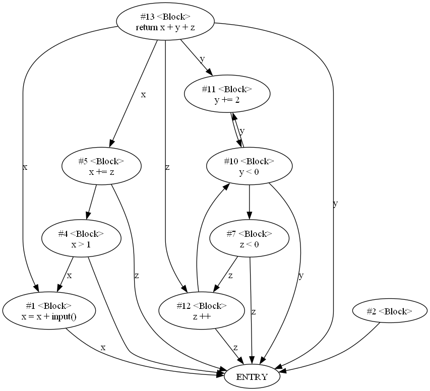

入门教程
=======
这里是入门教程，注意，**所有的教程源代码都在`examples/`文件夹下，**
**大家不用手动复制代码，到这个文件夹下找就可以了！**

## 获取UAST & UAST 的保存与读取

- UAST的文档见：[UAST Docs](https://hzy15610046011.gitee.io/metronome-static/html/api/universal_ast.html)

- 该示例位于`examples/uast-conversion`下

### 给定一个待分析的C文件:

`examples/uast-conversion/uast-demo.c`

```c
int main(int paramA, int paramB)
{
    if (paramA < 0)
    {
        return -1;
    }
    return paramA + paramB;
}
```

### 使用的Python文件：

`examples/uast-conversion/demo.py`

```python
import json

from PyBirdViewCode.clang_utils import *
from PyBirdViewCode import *

# 获取 Clang AST 的Cursor对象
file_cursor = parse_file("uast-demo.c").cursor

# 获取函数main的Cursor对象
cursor = get_func_decl(file_cursor, "main")

# 使用ClangASTConverter将Cursor对象转换为UAST
converter = ClangASTConverter()
uast = converter.eval(cursor)
print(uast)

# 将UAST转换为JSON格式并保存到文件
with open("dumped-ast.json", "w") as f:
    json.dump(uast.to_dict(), f, indent=2, ensure_ascii=False)

```

### 运行输出:


```plaintext
MethodDeclaration(name='main', modifiers=[], type_parameters=[], parameters=[None, None], return_type='NotImplemented', body=Block(statements=[IfThenElse(predicate=BinaryExpression(operator='<', lhs=Name(value='paramA'), rhs=Literal(value=0)), if_true=Block(statements=[Return(result=Unary(sign='p-', expression=Literal(value=1)))]), if_false=None), Return(result=BinaryExpression(operator='+', lhs=Name(value='paramA'), rhs=Name(value='paramB')))]), abstract=False, extended_dims=0, throws=None)
```

可以看出，直接print输出的结果可读性并不太好，但查看打印出的JSON就轻松多了：


```json
{
  "_cls": "MethodDeclaration",
  "name": "main",
  "modifiers": [],
  "type_parameters": [],
  "parameters": [
    null,
    null
  ],
  "return_type": "NotImplemented",
  "body": {
    "_cls": "Block",
    "statements": [
      {
        "_cls": "IfThenElse",
        "predicate": {
          "_cls": "BinaryExpression",
          "operator": "<",
          "lhs": {
            "_cls": "Name",
            "value": "paramA"
          },
          "rhs": {
            "_cls": "Literal",
            "value": 0
          }
        },
        "if_true": {
          "_cls": "Block",
          "statements": [
            {
              "_cls": "Return",
              "result": {
                "_cls": "Unary",
                "sign": "p-",
                "expression": {
                  "_cls": "Literal",
                  "value": 1
                }
              }
            }
          ]
        },
        "if_false": null
      },
      {
        "_cls": "Return",
        "result": {
          "_cls": "BinaryExpression",
          "operator": "+",
          "lhs": {
            "_cls": "Name",
            "value": "paramA"
          },
          "rhs": {
            "_cls": "Name",
            "value": "paramB"
          }
        }
      }
    ]
  },
  "abstract": false,
  "extended_dims": 0,
  "throws": null
}
```

以上的JSON是一个嵌套结构，每一项的`_cls`属性记录了UAST节点的类名，其余不以下划线开头的属性都是该节点相应对象的属性。

既然UAST可以保存，那么也可这样读取：


```python
import json

from PyBirdViewCode import universal_ast_nodes as nodes


# 从json文件中加载AST
with open("dumped-ast.json", "r") as f:
    ast = nodes.SourceElement.from_dict(json.load(f))
    print(ast)

```

## 遍历UAST

### 待分析的C文件


```c
#include <stdio.h>

int main()
{
    int a, b;
    scanf("%d %d", a, b);
    printf("Hello World!\n");
}

```

### Python分析脚本

通过以下方法，可以遍历该C文件的所有FuncCall节点，并打印出其函数名：


```python
from PyBirdViewCode.clang_utils import *
from PyBirdViewCode import universal_ast_nodes as nodes, ClangASTConverter


class UniASTVisitor(nodes.Visitor):
    def visit_FuncCall(self, node: nodes.CallExpr):
        print(node.name)


# 获取 Clang AST 的Cursor对象
file_cursor = parse_file("demo.c").cursor

# 获取函数main的Cursor对象
cursor = get_func_decl(file_cursor, "main")

# 获取UAST
ast = ClangASTConverter().eval(cursor)

# 使用UniASTVisitor遍历UAST
ast.accept(UniASTVisitor())

```

输出：


```plaintext
Name(value='scanf')
Name(value='printf')
```

## 用上层API获取代码属性图
## （包括控制流图CFG、数据依赖图DDG、控制依赖图CDG和程序依赖图PDG）

### 待分析的C文件：

`examples/code-property-graph/demo.c`

```c
int main(int x, int y, int z)
{
    if (x > 1)
    {
        x += z;
    }
    while (z < 0)
    {
        if (y < 0)
        {
            y += 2;
        }
        else
        {
            z++;
        }
    }
}
```

运行如下Python文件，可抽取出代码属性图，输出Dot文件，并将dot转为PNG：

### Python分析脚本
`examples/code-property-graph/demo.py`

```python
import sys

sys.path.append("../../")

# from PyBirdViewCode
from PyBirdViewCode import (
    FileManager,
    get_file_uast,
    get_method_cpg,
    UASTQuery,
)

# 在当前路径下创建FileManager对象
fm = FileManager(".")

# 获取文件的UAST
file_uast = get_file_uast("demo.c")

# 通过UASTQuery，获取函数的UAST
func_uast = UASTQuery.get_method(file_uast, "main")

# 抽取代码属性图
cpgs = get_method_cpg(func_uast)

# 控制流图 （CFG）
fm.dot_dump(cpgs.cfg_nx, "cfg.dot", export_png=True)

# 控制依赖图（CDG）
fm.dot_dump(cpgs.cdg_nx, "cdg.dot", export_png=True)

# 数据依赖图（DDG）
fm.dot_dump(cpgs.ddg_nx, "ddg.dot", export_png=True)

# 程序依赖图（PDG）
fm.dot_dump(cpgs.pdg_nx, "pdg.dot", export_png=True)

```

### Python文件解读：
#### 1. 使用PyBirdViewCode中的FileManager类，可以更方便的管理生成的代码属性图和JSON等文件。
- 如下的语句，含义为创建一个FileManager对象fm，其管理的目录为PATH。
```python
fm = FileManager(PATH)
```
当用fm写入或读取文件时，fm会自动在传入的相对路径上添加PATH这个绝对路径。
- 例如，如下的语句，含义为将networkx的图对象graph，写入`PATH/test.dot`下面
```python
fm.dot_dump(graph, "test.dot")
```
- FileManager还可以载入dot文件：
```python
graph = fm.dot_load("test.dot") # 加载了PATH/目录下的test.dot文件
```
- FileManager除了支持`dot_dump`和`dot_load`，
还支持`json_dump`和`json_load`，用于序列化/反序列化Python内置对象为json格式。
使用方法与标准库json中的dump/load相同
```python
fm.json_dump({"abc": "def"}, "test.json")
a = fm.json_load("test.json") # a 为 {"abc": "def"}
```
#### 2. 抽取函数的UAST
抽取函数的UAST需要两步，首先抽取文件的UAST，然后再通过`UASTQuery`里面的查询
来获取func_uast
```python
file_uast = get_file_uast("demo.c") # 获取文件的UAST
func_uast = UASTQuery.get_method(file_uast, "main") # 获取函数的UAST
```

#### 3. 获取代码属性图

拿到函数的UAST之后，就可以获取代码属性图了，代码属性图简称为CPG，
对应的类型为`CodePropertyGraph`类，通过`get_method_cpg`方法来获取。

### 获取的各个CPG

#### 控制流图（CFG）


#### 控制依赖图（CFG）


#### 数据依赖图（DDG）


#### 程序依赖图（PDG）


       

## 用底层API获取控制流图CFG

### 待分析的C文件

`examples/cfg-extraction/demo.c`

```c
#include <stdio.h>

int main(int a, int b)
{
    if (a < 0)
    {
        return -1;
    }
    for (int i = 0; i < b; i++)
    {
        a += i;
    }
}

```

### Python文件
运行如下Python文件将其转换为控制流图，并且输出Dot文件：

`examples/cfg-extraction/demo.py`

```python
import networkx as nx
from PyBirdViewCode.clang_utils import *
from PyBirdViewCode import universal_ast_nodes as nodes, ClangASTConverter, CFGBuilder


# 获取 Clang AST 的Cursor对象
file_cursor = parse_file("demo.c").cursor

# 获取函数main的Cursor对象
cursor = get_func_decl(file_cursor, "main")

# 获取UAST
ast = ClangASTConverter().eval(cursor)

# 使用CFGBuilder构建CFG
cfg_builder = CFGBuilder()
cfg = cfg_builder.build(ast)

# 将CFG转换为networkx的网络，并且保存为dot
# 得到.dot文件之后，可以用
#  `dot -Tpng cfg.dot -o cfg.png`转化cfg.dot为图片
g = cfg.to_networkx()
nx.nx_pydot.write_dot(g, "cfg.dot")

```

得到.dot文件之后，可以用`dot -Tpng cfg.dot -o cfg.png`转化cfg.dot为png格式的图片，如下图：


注意，如果提示没有安装dot，可以按照<https://graphviz.org/download/> 这里的方式进行安装


<style>
    .pic-container {
        display: flex;
        flex-direction: column;
        align-items: center;
    }
    
    .v-spacer {
        flex-grow: 1;
    }

</style>