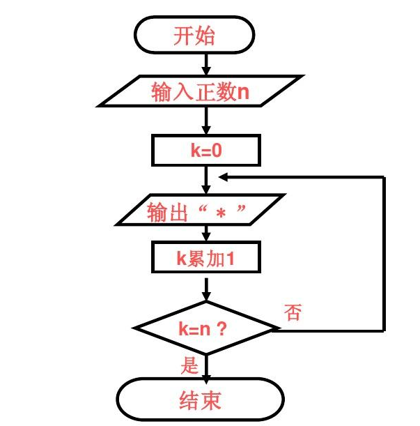
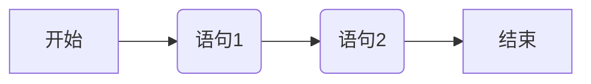
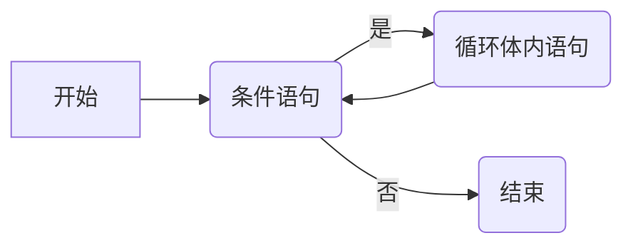
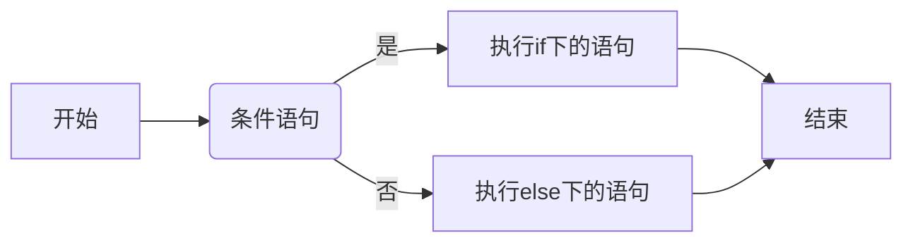
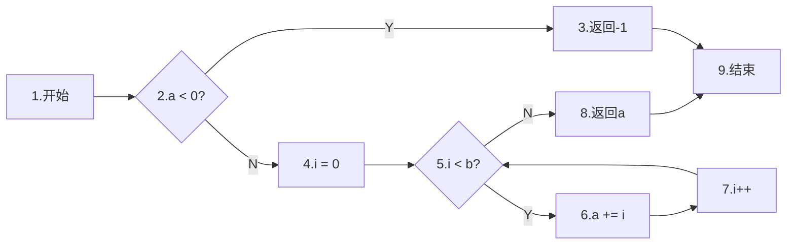
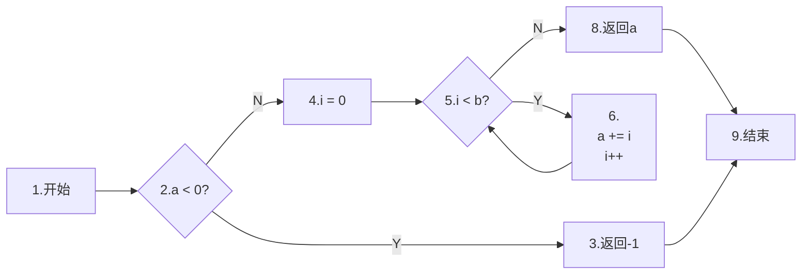

# 程序分析基础理论分享

[TOC]

## 程序的图表示

程序图是程序设计语言中常用的一种表示方式，它将程序的各个模块用图形表示，方便理解。

常见的程序图有：控制流图(Control Flow Graph, CFG)、数据依赖图(Data Dependence Graph, DDG)，数据流图(Data Flow Graph, DG)等。

### 控制流图

#### 引入：程序的基本控制结构

无论学习何种编程语言，我们通常都会接触到其控制结构，控制结构是组织代码的逻辑框架，它指导计算机以何种顺序和条件执行程序的指令。我们常说的“if/else语句”，“for循环语句”，“Java中没有goto”以及“Python 3.10增加了类似于switch的match...case语法”等等，描述的都是程序的控制结构。

程序控制结构是可以使用**图**进行表示的，称为程序框图或者算法框图。如下图这样的算法框图，我们早在中学时就已经接触过：



每一段程序的控制结构都能表示为程序框图的形式，因此，五花八门的程序，其框图自然也千变万化。但万变不离其宗，程序框图可主要分为三大基本模式——**顺序、分支和循环**

- 顺序结构：程序按顺序执行语句。特别地，顺序执行的一系列语句只有单一的执行入口和执行出口，因此可以看作一个整体，称为**基础块（Basic Block）**



- 循环结构：若满足条件则执行循环体内语句，否则跳出循环



- 分支结构：根据条件执行不同的语句



看到这里，我想大家已经基本建立了“程序控制结构”以及相关图表示的概念。现在，我们就可以引入本节的主角：**控制流图**了

#### 控制流图的定义

首先说一句暴论——**控制流图=算法框图**。只不过当我们说“算法框图”时，脑中浮现的通常是手绘/用ppt等手绘的执行流程；而当我们说到“控制流图”的时候，更侧重于它可用图论等数学方法阐释的一面

如果要更加严格的进行定义，那么控制流图（Control Flow Graph，CFG）就是表示程序执行流程的有向图。控制流图的节点通常代表程序中的语句或基础块(基础块的定义见上节)，而边则代表控制流的转移，即程序从一个语句跳转到另一个语句的路径

#### 控制流图的示例

考虑如下的代码。这部分代码包含一个if语句，以及一个for循环结构。

```c
int f(int a, int b)
{
    if (a < 0)
    {
        return -1;
    }
    else
    {
        for (int i = 0; i < b; i++)
        {
            a += i;
        }
    }
    return a;
}
```

这部分代码的控制流图可以用mermaid绘制如下：



考虑到语句6.和7.均位于循环体中，可以看作是一个基础块，因此可合并这两个节点，将图画成：



### 数据依赖图

数据依赖指的就是：一条语句A中一个变量x的定义，可以到达语句B中对x的使用，以Python代码举例如下：

```python
# 语句A
x = 1
if <condition>:
    # 语句B
    a = x
```

或者换种说法，就是语句B使用的变量x（读），依赖于语句A中x的赋值（写）

因此，将每一个语句作为节点，节点之间的变量依赖关系用箭头表示，就可以得到数据依赖图（Data Dependence Graph，DDG）了。比如以上代码片段，有一条边`B --> A`

#### 数据依赖图的创建

数据依赖图的构建过程主要包括以下步骤：

1. 遍历源代码中的每个语句，为每个程序表达式(Expression)创建一个节点
2. 根据定义-使用依赖关系，为每个表达式创建一个入度边
3. 根据反向依赖关系，为每个表达式创建一个出度边
4. 构建有向图，其中每个节点表示一个表达式，每条边表示一个数据依赖关系
